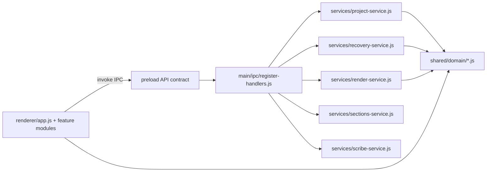

# Target Architecture

## Goals

- Separate concerns between Electron runtime, domain rules, renderer UI, and infrastructure.
- Keep feature behavior stable while making each layer independently testable.
- Make new features appendable without touching unrelated modules.

## Module Layout

```text
src/
  main/
    app/
      create-window.js
      lifecycle.js
    ipc/
      register-handlers.js
    services/
      project-service.js
      recovery-service.js
      render-service.js
      sections-service.js
      scribe-service.js
      media-service.js
    infra/
      file-system.js
      process-runner.js
  renderer/
    app.js
    state.js
    constants/
      index.js
    features/
      dom/
        elements.js
      drawing/
        compositing.js
      editor/
        transport.js
        zoom-crop.js
      capture/
        source-picker.js
      transcript/
        transcript-utils.js
      timeline/
        section-utils.js
        keyframe-utils.js
      geometry/
        pip-geometry.js
        section-geometry.js
      keyframe/
        mode-state.js
      format/
        format-utils.js
      recording/
        pcm-utils.js
        recording.js
      overlay/
        window-overlays.js
        overlay.js
      audio-overlay/
        audio-overlay.js
      section/
        section-editing.js
      media/
        take-media.js
      workspace/
        workspace.js
      background/
        background-image.js
      project/
        project-lifecycle.js
      render/
        render.js
    services/
      electron-api.js
      project-session.js
    styles/
      tailwind.input.css
      tailwind.css
  shared/
    domain/
      project.js
      timeline.js
      transcript.js
      easing.js
      section-math.js
      canvas.js
```

`shared/domain/easing.js` (interpolation curve + ffmpeg expression) and `shared/domain/section-math.js` (section pad/merge/remap + `roundMs`) are the canonical implementations of these rules; both the renderer and the main process delegate to them instead of keeping per-layer copies.

`shared/domain/canvas.js` is the canonical home for canvas/PIP/reel geometry constants (`CANVAS_W`, `CANVAS_H`, `REEL_CANVAS_W`, `REEL_CANVAS_H`, `PIP_FRACTION`, `PIP_MARGIN`, `PIP_SIZE`, `MIN_SECTION_PAN`, `MAX_SECTION_PAN`, plus re-exported `MIN_REEL_CROP_X`/`MAX_REEL_CROP_X`/`MIN_PIP_SCALE`/`MAX_PIP_SCALE`/`DEFAULT_PIP_SCALE` from `shared/types/domain.js`) and the parameterized `getContentWidth` helper; the renderer and `main/services/render-filter-service.js` (which re-exports `getContentWidth`) both consume it instead of duplicating the dimensions or the fit algorithm. The renderer's geometry/formatting/recording pure helpers extracted from `app.js` live under `renderer/features/{geometry,keyframe,format,recording,overlay}/*` with direct unit coverage. `renderer/features/dom/elements.js` is the canonical DOM-bindings module: it resolves every module-level DOM element once (preserving each id, type cast, and non-null assertion) plus the associated canvas dimension setup, and exports them as named bindings that `app.js` (and future feature modules) import instead of redeclaring `document.getElementById(...)` at module scope.

`renderer/state.js` is the canonical renderer **mutable state store**: it owns every module-level mutable global formerly declared at the top of `app.js`. Stable bindings (arrays, Maps, caches/pools, and configuration constants that are never reassigned) are exported as `const`; reassignable state is exported as `let` together with a `setX` setter, plus its state-only type definitions (`EditorState`, `TimelineSnapshot`, `TakeVideos`, `ProxyEntry`, `TrimDragState`, `BackgroundDragState`, `CropDragState`, `OverlayTrimDragState`, `SpeechSegment`, `AppMediaRecorder`, `PickerMode`). `app.js` (and future feature modules) import these bindings and **read them directly via ESM live bindings** — reads stay byte-identical and unchanged — while reassignments go through the setters (`foo = x` → `setFoo(x)`). This keeps a single owner for shared renderer state without rewriting read sites, and the renderer health gate proves state still initializes and updates correctly through the live bindings + setters at runtime.

`renderer/features/capture/source-picker.js` is the canonical **capture source** module: it owns the source-picker UI (`updatePickerButtonText`, `renderPickerPanel`, `createPickerRadioRow`, `createPickerCheckboxRow`, `applyPickerSelection`, `populatePickerSources`, `enumerateDevices`) and the capture-stream lifecycle it drives (`updateScreenStream`, `updateCameraStream`, `updateAudioStream`, `updateWindowStreams`, `cleanupWindowStreams`), extracted verbatim from `app.js`. It consumes renderer state from `state.js` (picker/stream live bindings + setters) and DOM from `features/dom/elements.js`, and uses `window.electronAPI` / `navigator.mediaDevices` as ambient globals; the picker-UI and stream functions are co-located so their mutual calls stay internal to the module. It imports `updatePreview` from `features/drawing/compositing.js` and `pickAndLoadBackground` from `app.js`; the audio-meter helpers it drives (`startAudioMeter`, `stopAudioMeter`) are imported from `features/recording/recording.js`. Background-image handling (`pickAndLoadBackground`, `loadBackgroundFromPath`) deliberately stays in `app.js`.

`renderer/features/recording/recording.js` is the canonical **recording** module: it owns the recording lifecycle, audio-capture meter, and live-transcript cluster (`startAudioMeter`, `stopAudioMeter`, `toggleRecording`, `getSupportedRecorderMimeType`, `getRecorderOptions`, `createRecorder`, `addAudioToStream`, `startRecording`, `updatePartialTranscript`, `commitTranscript`, `recoverPendingTake`, `setProcessingProgress`, `stopRecording`, `updateTimer`), extracted verbatim from `app.js`. It consumes renderer state from `state.js` (recording/transcript/stream live bindings + setters) and DOM from `features/dom/elements.js`, `mergeInt16Arrays` from `features/recording/pcm-utils.js`, and transcript/section helpers from `features/transcript/transcript-utils.js` and `features/timeline/section-utils.js`; Web Audio / `MediaRecorder` / `window.electronAPI` stay ambient. `renderSectionMarkers` is imported from `features/section/section-editing.js`. Project-lifecycle helpers (`completeRecoveryTake`, `getActiveProjectSession`, `matchesActiveProjectSession`, `persistProjectNow`, `saveRecoveryTake`) are imported from `features/project/project-lifecycle.js`; remaining not-yet-extracted helpers it still calls (`appendTakeToTimeline`, `selectSegment`, `setWorkspaceView`, `updateSegmentBadge`, `updateWorkspaceHeader`) are imported from `app.js` (circular, esbuild-handled) and shrink as those domains extract. `app.js` imports only the entry points it invokes (`stopAudioMeter`, `toggleRecording`, `setProcessingProgress`), and `features/project/project-lifecycle.js` imports `recoverPendingTake` (used by `openProjectByPath`); `ensureMediaInitialized` stays in `app.js` because its sole caller is the non-recording workspace router (`setWorkspaceView`).

`renderer/features/drawing/compositing.js` is the canonical **drawing/compositing** module: it owns the canvas compositing/preview/PiP/background/fit-fill/zoom cluster (`getEffectiveCanvasDimensions`, `drawPip`, `drawCameraRect`, `drawBackground`, `updatePreview`, `drawComposite`, `drawFit`, `drawFitRounded`, `drawFill`, `drawEditorScreenWithZoom`), extracted verbatim from `app.js`. It consumes renderer state from `state.js` (editor/stream/background live bindings + `setDrawRAF`), canvas contexts and DOM from `features/dom/elements.js`, and geometry constants from `shared/domain/canvas.js`; Canvas / `Image` / `HTMLVideoElement` APIs stay ambient. Zoom/crop helpers (`clampSectionZoom`, `resolveZoomCrop`, `panToFocusCoord`) are imported from `features/editor/zoom-crop.js` (circular, esbuild-handled). `app.js` imports only the entry points it invokes (`getEffectiveCanvasDimensions`, `updatePreview`, `drawBackground`, `drawEditorScreenWithZoom`, `drawCameraRect`, `drawPip`); `features/capture/source-picker.js` imports `updatePreview` and `features/project/project-lifecycle.js` imports `getEffectiveCanvasDimensions` (for `restoreSnapshot`) from this module. `drawWaveformOnCanvas` (audio-overlay waveform domain) lives in `features/audio-overlay/audio-overlay.js`.

`renderer/features/editor/zoom-crop.js` is the canonical **zoom/crop + output-mode** module: it owns the editorState-coupled zoom/crop/output-mode cluster (`clampSectionZoom`, `formatSectionZoom`, `setOutputMode`, `updateOutputModeUI`, `getZoomCropBounds`, `resolveZoomCrop`, `panToFocusCoord`, `focusToPanCoord`), extracted verbatim from `app.js` (function bodies unchanged; only location + explicit imports change). It consumes renderer state from `state.js` (`editorState` live binding + the `MIN_SECTION_ZOOM`/`MIN_REEL_SECTION_ZOOM`/`MAX_SECTION_ZOOM`/`DEFAULT_SECTION_ZOOM` constants), DOM from `features/dom/elements.js` (`editorModeLandscapeBtn`/`editorModeReelBtn`, `editorPipSizeControl`/`-Input`/`-Value`, `editorCropPresets`, `editorBgZoomInput`), canvas constants (`CANVAS_W`, `CANVAS_H`, `PIP_MARGIN`, `DEFAULT_PIP_SCALE`) from `shared/domain/canvas.js`, `normalizePipScale` from `shared/domain/project-fields.js`, the `OutputMode` type from `shared/types/domain.js`, mode-state helpers (`saveModeState`, `restoreModeState`, `getDefaultModeState`) from `features/keyframe/mode-state.js`, pure pan clamp `clampSectionPan` from `features/geometry/section-geometry.js`, `computePipSize` from `features/geometry/pip-geometry.js`, section helpers (`getSelectedSection`, `getSectionAnchorKeyframe`, `updateSectionZoomControls`) from `features/section/section-editing.js`, `getEffectiveCanvasDimensions` from `features/drawing/compositing.js`, and `pushUndo`/`scheduleProjectSave` from `features/project/project-lifecycle.js`; DOM / canvas APIs stay ambient. `app.js` imports only the entry points it invokes (`clampSectionZoom`, `setOutputMode`, `updateOutputModeUI`, `getZoomCropBounds`, `resolveZoomCrop`); the back-importing siblings `features/drawing/compositing.js` (`clampSectionZoom`, `resolveZoomCrop`, `panToFocusCoord`), `features/editor/transport.js` (`clampSectionZoom`, `focusToPanCoord`, `panToFocusCoord`), `features/section/section-editing.js` (`clampSectionZoom`, `formatSectionZoom`), and `features/project/project-lifecycle.js` (`clampSectionZoom`, `updateOutputModeUI`) now import these from this module (no longer from `app.js`). The pure pan/clamp math (`clampSectionPan`, `clampReelCropX`, `reelCropXToPixelOffset`) deliberately stays in `features/geometry/section-geometry.js`; the render/drag/background helpers stay in `app.js`. The continuously-running editor draw loop exercises this code, so the renderer-health gate is a strong runtime proof.

`renderer/features/editor/transport.js` is the canonical **editor playback-transport** module: it owns the editor draw loop + transport controls + playback sync + visual-state-at-time cluster (`hasPendingEditorDraw`, `cancelEditorDrawLoop`, `scheduleEditorDrawLoop`, `getStateAtTime`, `getOverlayStateAtTime`, `getTimelineBoundaries`, `updateEditorTimeDisplay`, `switchPlaybackSection`, `syncCameraPlayback`, `editorPlay`, `editorPause`, `editorTogglePlay`, `cyclePlaybackSpeed`, `editorSeek`, `syncOverlayVideo`, `updateScrubberPosition`, `editorDrawLoop`) plus the `VisualState` return type, extracted verbatim from `app.js`. It consumes renderer state from `state.js` (editor/playback/camera-drift live bindings + setters and the `CAMERA_DRIFT_*`/`CAMERA_RESYNC_COOLDOWN_MS`/`DEFAULT_SECTION_ZOOM`/`TRANSITION_DURATION` constants), DOM from `features/dom/elements.js` (`editorCtx`, `editorTimeEl`, `editorPlayBtn`, `editorScrubber`), drawing from `features/drawing/compositing.js` (`drawBackground`, `drawEditorScreenWithZoom`, `drawCameraRect`, `drawPip`), overlay-state from `features/timeline/overlay-utils.js` (`getOverlayStateAtTime` as `_getOverlayStateAtTime`), camera-sync from `features/timeline/camera-sync.js` (`computeCameraPlaybackDrift`, `resolveCameraPlaybackTargetTime`), smoothed-mouse lookup from `features/timeline/mouse-trail.js`, and geometry/canvas/easing/format helpers from `features/geometry/*` + `shared/domain/{canvas,project-fields,easing}.js` + `features/format/format-utils.js`; `requestAnimationFrame` / `requestVideoFrameCallback` / video-element APIs stay ambient. `getSelectedSection`/`findSectionForTime` are imported from `features/section/section-editing.js`, and zoom/crop helpers (`clampSectionZoom`, `panToFocusCoord`, `focusToPanCoord`) from `features/editor/zoom-crop.js`. Take/media helpers (`getOrCreateTakeVideos`, `resolveTimeToSource`, `getMouseTrailForTake`) are imported from `features/media/take-media.js`; `scrollTimelineToPlayhead` from `features/editor/interactions.js`; `getOverlayVideoElement`/`getOverlayImageElement` from `features/overlay/overlay.js`; audio-overlay playback (`startAudioOverlayPlayback`, `stopAudioOverlayPlayback`) is imported from `features/audio-overlay/audio-overlay.js`. `app.js` imports only the entry points it invokes (`hasPendingEditorDraw`, `cancelEditorDrawLoop`, `scheduleEditorDrawLoop`, `getStateAtTime`, `getOverlayStateAtTime`, `getTimelineBoundaries`, `updateEditorTimeDisplay`, `editorTogglePlay`, `cyclePlaybackSpeed`, `editorSeek`) — `editorPause`/`editorDrawLoop` are now consumed by `features/workspace/workspace.js` instead; `enterEditor` (editor bootstrap/orchestrator) deliberately stays in `app.js`; `features/project/project-lifecycle.js` imports `cancelEditorDrawLoop`/`editorPause`/`editorSeek` (for `clearEditorState`/`restoreSnapshot`) from this module. The continuously-running editor draw loop makes the renderer-health gate a strong runtime proof for this module.

`renderer/features/audio-overlay/audio-overlay.js` is the canonical **audio-overlay** module: it owns the audio-overlay timeline editing + Web Audio decode/waveform/playback cluster (`toggleAudioOverlaySaved`, `readdSavedAudioOverlay`, `selectAudioOverlay`, `renderAudioOverlayMarkers`, `startAudioOverlayTrimDrag`, `updateAudioOverlayTrimDrag`, `splitAudioOverlayAtPlayhead`, `deleteSelectedAudioOverlay`, `placeAudioOverlayAtTime`, `getAudioOverlayContext`, `decodeAndCacheAudioBuffer`, `extractPeakData`, `drawWaveformOnCanvas`, `startAudioOverlayPlayback`, `stopAudioOverlayPlayback`, `clearAudioBufferCache`), extracted verbatim from `app.js`. It consumes renderer state from `state.js` (audio-overlay buffer/peak caches, `audioOverlayContext`, `activeAudioOverlayNodes`, `audioOverlayTrimDragState` live bindings + setters), DOM from `features/dom/elements.js` (`editorAudioTrack0`, `editorTimeline`), `generateAudioOverlayId` from `shared/domain/project-fields.js`, the `AudioOverlay` type from `shared/types/domain.js`, and `formatTime` from `features/format/format-utils.js`; Web Audio (`AudioContext`, `decodeAudioData`) and canvas APIs stay ambient. `renderSectionMarkers` is imported from `features/section/section-editing.js`. Project-lifecycle helpers (`pushUndo`, `scheduleProjectSave`) are imported from `features/project/project-lifecycle.js`; `renderOverlayList`/`renderOverlayMarkers` are imported from `features/overlay/overlay.js` (the visual-overlay module). `app.js` imports only the entry points it invokes (`toggleAudioOverlaySaved`, `readdSavedAudioOverlay`, `selectAudioOverlay`, `renderAudioOverlayMarkers`, `startAudioOverlayTrimDrag`, `splitAudioOverlayAtPlayhead`, `deleteSelectedAudioOverlay`, `placeAudioOverlayAtTime`, `clearAudioBufferCache`); `features/editor/transport.js` imports `startAudioOverlayPlayback`/`stopAudioOverlayPlayback` from this module.

`renderer/features/overlay/overlay.js` is the canonical **visual-overlay (image/video)** module: it owns the image/video overlay editing cluster (`getOverlayImageElement`, `getOverlayVideoElement`, `selectOverlay`, `updateOverlaySizeControl`, `buildVolumeHeartStack`, `renderOverlayList`, `toggleOverlaySaved`, `readdSavedOverlay`, `renderOverlayMarkers`, `startOverlayTrimDrag`, `updateOverlayTrimDrag`, `splitOverlayAtPlayhead`, `deleteSelectedOverlay`, `placeOverlayAtTime`, `handleOverlayDrop`, `centerSelectedOverlay`) plus the overlay media-element pools and volume/heart UI, extracted verbatim from `app.js`. It consumes renderer state from `state.js` (overlay caches `overlayImageCache`/`overlayVideoEls`/`overlayVideoCurrentPaths`, `overlayTrackEls`, `overlayTrimDragState` + `setOverlayTrimDragState`, `preMuteVolumes`, `undoStack`, the `OVERLAY_*`/`AUDIO_OVERLAY_EXTENSIONS` constants, `activeProjectPath`/`activeSidebarTab`/`editorState` live bindings), DOM from `features/dom/elements.js` (`editorOverlayList`, `editorOverlaySizeControl`/`-Input`/`-Value`, `editorTimeline`), `generateOverlayId`/`generateAudioOverlayId` from `shared/domain/project-fields.js`, canvas constants/`getContentWidth` from `shared/domain/canvas.js`, `formatTime`/`hexToRgba`/`getVolumeSvg` from `features/format/format-utils.js`, `reelCropXToPixelOffset` from `features/geometry/section-geometry.js`, `getStateAtTime`/`editorSeek` from `features/editor/transport.js`, and the `Overlay`/`AudioOverlay` types from `shared/types/domain.js`; `Image` / `HTMLVideoElement` / canvas APIs stay ambient. Audio-overlay siblings (`toggleAudioOverlaySaved`, `readdSavedAudioOverlay`, `selectAudioOverlay`, `renderAudioOverlayMarkers`, `placeAudioOverlayAtTime`) are imported from `features/audio-overlay/audio-overlay.js`. `renderSectionMarkers` is imported from `features/section/section-editing.js`. Project-lifecycle helpers (`pushUndo`, `scheduleProjectSave`, `updateUndoRedoButtons`) are imported from `features/project/project-lifecycle.js`; remaining not-yet-extracted helpers it still calls (`initScrubDrag`, `pathToFileUrl`) are imported from `app.js` (circular, esbuild-handled) and shrink as those domains extract. `app.js` imports only the entry points it invokes (`buildVolumeHeartStack`, `centerSelectedOverlay`, `deleteSelectedOverlay`, `handleOverlayDrop`, `placeOverlayAtTime`, `renderOverlayList`, `renderOverlayMarkers`, `selectOverlay`, `splitOverlayAtPlayhead`, `startOverlayTrimDrag`, `updateOverlaySizeControl`); `features/editor/transport.js` imports `getOverlayImageElement`/`getOverlayVideoElement` and `features/audio-overlay/audio-overlay.js` imports `renderOverlayList`/`renderOverlayMarkers` from this module.

`renderer/features/section/section-editing.js` is the canonical **section/timeline editing** module: it owns the stateful section/timeline editing cluster (`recalculateTimelinePositions`, `toggleSectionSaved`, `readdSavedSection`, `findSectionForTime`, `getSelectedSection`, `getSectionBackgroundZoom`, `getSectionBackgroundPan`, `updateSectionZoomControls`, `getSectionAnchorKeyframe`, `syncSectionAnchorKeyframes`, `selectEditorSection`, `applyStyleToFutureSections`, `renderSectionTranscriptList`, `switchSidebarTab`, `renderSectionMarkers`, `remapManualKeyframesAfterSectionDelete`, `remapOverlaysAfterSectionDelete`, `remapAudioOverlaysAfterSectionDelete`, `deleteSelectedSection`, `splitSectionAtPlayhead`, `splitAllAtPlayhead`, `setSelectedSectionBackgroundZoom`, `setSectionBackgroundPan`, `commitSectionZoomChange`), extracted verbatim from `app.js`. It consumes renderer state from `state.js` (`editorState`/`activeProject`/`activeProjectPath`/`proxyStatus`/`sectionZoomDragActive` live bindings + `DEFAULT_SECTION_ZOOM` and the `setActiveProject`/`setActiveSidebarTab`/`setSectionZoomDragActive` setters), DOM from `features/dom/elements.js` (`editorBgZoomInput`/`-Value`, `editorPipSizeInput`/`-Value`, `editorAutoTrackControl`/`-Toggle`/`-SmoothInput`/`-SmoothValue`, `editorSectionMarkers`, `editorSectionTranscriptList`, `editorOverlayList`, `sidebarTabSegments`/`-Overlays`), pure timeline/keyframe math from `features/timeline/section-utils.js` (`roundMs`) and `features/timeline/keyframe-ops.js` (`generateSectionId`, `reindexSections`, `buildSplitAnchorKeyframe`), geometry clamps from `features/geometry/section-geometry.js` (`clampSectionPan`, `clampReelCropX`), `normalizePipScale`/`generateOverlayId`/`generateAudioOverlayId` from `shared/domain/project-fields.js`, `DEFAULT_PIP_SCALE` from `shared/domain/canvas.js`, `formatTime` from `features/format/format-utils.js`, `normalizeTranscriptText` from `features/transcript/transcript-utils.js`, and the `Section`/`Keyframe`/`Overlay`/`AudioOverlay`/`PipSnapPoint` types from `shared/types/domain.js`; DOM / canvas / `window.electronAPI` APIs stay ambient. Sibling entry points are imported from `features/overlay/overlay.js` (`renderOverlayList`, `renderOverlayMarkers`, `buildVolumeHeartStack`), `features/audio-overlay/audio-overlay.js` (`renderAudioOverlayMarkers`), and `features/editor/transport.js` (`getStateAtTime`, `editorSeek`, `updateEditorTimeDisplay`). Project-lifecycle helpers (`pushUndo`, `scheduleProjectSave`, `persistProjectNow`, `stageTakeIfUnreferenced`, `clearEditorState`) are imported from `features/project/project-lifecycle.js`, and zoom/crop helpers (`clampSectionZoom`, `formatSectionZoom`) from `features/editor/zoom-crop.js`; remaining not-yet-extracted helpers it still calls (`setWorkspaceView`, `getMouseTrailForTake`, `refreshWaveform`) are imported from `app.js` (circular, esbuild-handled) and shrink as the workspace/waveform domains extract. `app.js` imports only the entry points it invokes (`recalculateTimelinePositions`, `findSectionForTime`, `getSelectedSection`, `getSectionBackgroundPan`, `updateSectionZoomControls`, `getSectionAnchorKeyframe`, `syncSectionAnchorKeyframes`, `selectEditorSection`, `applyStyleToFutureSections`, `renderSectionTranscriptList`, `switchSidebarTab`, `renderSectionMarkers`, `deleteSelectedSection`, `splitSectionAtPlayhead`, `splitAllAtPlayhead`, `setSelectedSectionBackgroundZoom`, `setSectionBackgroundPan`, `commitSectionZoomChange`); the back-importing siblings `features/overlay/overlay.js`, `features/audio-overlay/audio-overlay.js`, and `features/recording/recording.js` import `renderSectionMarkers`, and `features/editor/transport.js` imports `findSectionForTime`/`getSelectedSection`, from this module (no longer from `app.js`). The continuously-running editor draw loop exercises this code, so the renderer-health gate is a strong runtime proof. The pure section math (`normalizeSections`, `buildDefaultSectionsForDuration`, `roundMs`, `reindexSections`, `buildSplitAnchorKeyframe`) deliberately stays in `features/timeline/section-utils.js`/`keyframe-ops.js`, and `enterEditor` (editor bootstrap) stays in `app.js`.

`renderer/features/project/project-lifecycle.js` is the canonical **project-lifecycle** module: it owns the project persistence + undo/redo + take-staging + activation + recent-projects cluster (`getActiveProjectSession`, `matchesActiveProjectSession`, `getProjectTimelineSnapshot`, `buildProjectSavePayload`, `persistProjectNow`, `saveRecoveryTake`, `completeRecoveryTake`, `scheduleProjectSave`, `flushScheduledProjectSave`, `clearEditorState`, `isTakeReferenced`, `stageTakeIfUnreferenced`, `unstageTakeById`, `snapshotTimeline`, `restoreSnapshot`, `pushUndo`, `editorUndo`, `editorRedo`, `updateUndoRedoButtons`, `renderRecentProjects`, `clearProjectHomeMessage`, `showProjectHomeMessage`, `refreshRecentProjects`, `activateProject`, `openProjectByPath`), extracted verbatim from `app.js` (function bodies unchanged; only location + explicit imports change). It consumes renderer state from `state.js` (`activeProject`/`activeProjectPath`/`activeProjectSession`/`editorState`/`backgroundImagePath`/`hideFromRecording` live bindings, the undo/redo stacks + caches `undoStack`/`redoStack`/`overlayImageCache`/`overlayVideoEls`/`overlayVideoCurrentPaths`/`mouseTrailCache`/`proxyStatus`/`persistQueue`/`saveDebounceTimer`, the `MAX_UNDO` constant, and the `setActiveProject`/`setActiveProjectPath`/`setActiveProjectSession`/`setEditorState`/`setHideFromRecording`/`setPersistQueue`/`setSaveDebounceTimer`/`setSaveFolder`/`setWaveformPeaks` setters) plus the `TimelineSnapshot` type, DOM from `features/dom/elements.js` (`cameraSyncOffsetInput`, `editorUndoBtn`/`editorRedoBtn`, `exportAudioPresetSelect`, `folderPathEl`, `lastProjectName`/`lastProjectPath`/`lastProjectRow`, `openFolderBtn`, `projectHomeMessage`, `recentProjectsList`, `resumeLastBtn`, `screenFitSelect`), shared project domain (`normalizeExportAudioPreset`, `normalizePipScale` from `shared/domain/project-fields.js`; `DEFAULT_PIP_SCALE`, `PIP_MARGIN` from `shared/domain/canvas.js`) and the `Project`/`ProjectTimeline`/`Take`/`RecentProjectsResult`/`RecoveryTake` types, `normalizeCameraSyncOffsetMs` from `features/timeline/camera-sync.js`, `computePipSize` from `features/geometry/pip-geometry.js`, `clampSectionPan`/`clampReelCropX` from `features/geometry/section-geometry.js`, `getEffectiveCanvasDimensions` from `features/drawing/compositing.js`, and `formatProjectDate` from `features/format/format-utils.js`; `window.electronAPI` stays ambient. Sibling re-render entry points for `restoreSnapshot`/`clearEditorState` are imported from `features/section/section-editing.js` (`recalculateTimelinePositions`, `renderSectionMarkers`, `renderSectionTranscriptList`, `syncSectionAnchorKeyframes`, `updateSectionZoomControls`), `features/editor/transport.js` (`cancelEditorDrawLoop`, `editorPause`, `editorSeek`), `features/audio-overlay/audio-overlay.js` (`clearAudioBufferCache`), and `features/recording/recording.js` (`recoverPendingTake`). The orchestrators `activateProject`/`openProjectByPath`/`restoreSnapshot`/`clearEditorState` import zoom/crop helpers (`clampSectionZoom`, `updateOutputModeUI`) from `features/editor/zoom-crop.js`, and call `enterEditor` (still in `app.js`, circular, esbuild-handled), `refreshWaveform`/`renderWaveform` from `features/editor/interactions.js`, `cleanupVideoPool`/`syncContentProtection` from `features/media/take-media.js`, `setWorkspaceView`/`updateWorkspaceHeader` from `features/workspace/workspace.js`, and `loadBackgroundFromPath` from `features/background/background-image.js`. `app.js` imports only the entry points it invokes (`activateProject`, `clearProjectHomeMessage`, `editorRedo`, `editorUndo`, `flushScheduledProjectSave`, `matchesActiveProjectSession`, `openProjectByPath`, `persistProjectNow`, `pushUndo`, `refreshRecentProjects`, `scheduleProjectSave`, `showProjectHomeMessage`, `updateUndoRedoButtons`); the back-importing siblings `features/overlay/overlay.js` (`pushUndo`, `scheduleProjectSave`, `updateUndoRedoButtons`), `features/audio-overlay/audio-overlay.js` (`pushUndo`, `scheduleProjectSave`), `features/section/section-editing.js` (`pushUndo`, `scheduleProjectSave`, `persistProjectNow`, `stageTakeIfUnreferenced`, `clearEditorState`), and `features/recording/recording.js` (`completeRecoveryTake`, `getActiveProjectSession`, `matchesActiveProjectSession`, `persistProjectNow`, `saveRecoveryTake`) now import these from this module (no longer from `app.js`). Default parameters referencing state (`completeRecoveryTake(projectPath = activeProjectPath)`) read the imported live binding at call time, preserving behavior. The render/drag/background/workspace router and `enterEditor` deliberately stay in `app.js`; the renderer-health gate proves runtime health.

`renderer/features/render/render.js` is the canonical **render/export** module: it owns the export payload builders, video render, thumbnail capture, render-button state, proxy-progress bars, and the small transcript-segment-selection UI (`handleRenderProgress`, `updateProxyProgressBars`, `getRenderKeyframes`, `getRenderSections`, `showThumbnailToast`, `setRenderBtnState`, `captureThumbnailFrame`, `renderVideo`, `selectSegment`, `applySegmentDeletedStyle`, `updateSegmentBadge`), extracted verbatim from `app.js` (function bodies unchanged; only location + explicit imports change). It consumes renderer state from `state.js` (`activeProject`/`activeProjectPath`/`backgroundImagePath`/`capturingThumbnail`/`editorState`/`editorRenderTimeout`/`saveFolder`/`selectedSegmentIndex`/`speechSegments`/`thumbnailToastTimer` live bindings, `DEFAULT_SECTION_ZOOM`, and the `setCapturingThumbnail`/`setEditorRenderTimeout`/`setSelectedSegmentIndex`/`setThumbnailToastTimer` setters), DOM from `features/dom/elements.js` (`editorCamFullBtn`, `editorPlayBtn`, `editorRedoBtn`, `editorRenderBtn`, `editorSectionMarkers`, `editorSplitBtn`, `editorToggleCamBtn`, `editorUndoBtn`, `exportAudioPresetSelect`, `processingStatus`, `processingTitle`, `segmentBadge`, `transcriptContent`), `getStateAtTime`/`editorPause`/`editorSeek` from `features/editor/transport.js`, section helpers (`commitSectionZoomChange`, `getSectionAnchorKeyframe`, `syncSectionAnchorKeyframes`, `updateSectionZoomControls`) from `features/section/section-editing.js`, `clampSectionZoom` from `features/editor/zoom-crop.js`, `clampReelCropX`/`clampSectionPan` from `features/geometry/section-geometry.js`, `setProcessingProgress` from `features/recording/recording.js`, `persistProjectNow`/`updateUndoRedoButtons` from `features/project/project-lifecycle.js`, canvas constants (`CANVAS_W`, `CANVAS_H`) from `shared/domain/canvas.js`, `DEFAULT_PIP_SCALE` and the `Keyframe`/`PipSnapPoint`/`Take` types from `shared/types/domain.js`, and `normalizeExportAudioPreset`/`normalizePipScale` from `shared/domain/project-fields.js`; `window.electronAPI` / canvas APIs stay ambient. `resolveTimeToSource` is imported from `features/media/take-media.js`. `app.js` imports the entry points it invokes (`applySegmentDeletedStyle`, `captureThumbnailFrame`, `handleRenderProgress`, `renderVideo`, `selectSegment`, `updateProxyProgressBars`, `updateSegmentBadge`) and keeps the `window.electronAPI.onRenderProgress(handleRenderProgress)` / `onProxyProgress` registrations in its bootstrap; `features/recording/recording.js` imports `selectSegment`/`updateSegmentBadge` from this module (no longer from `app.js`).

`renderer/features/editor/interactions.js` is the canonical **editor-interactions** module: it owns the editor timeline/canvas interaction + waveform + camera-toggle cluster (`computeWaveformPeaksFromCache`, `refreshWaveform`, `extractWaveformPeaks`, `renderWaveform`, `startTrimDrag`, `updateTrimDrag`, `finishTrimDrag`, `getMutableCameraKeyframe`, `toggleCameraVisibility`, `toggleCameraFullscreen`, `canvasToEditorCoords`, `seekFromTimeline`, `applyTimelineZoom`, `scrollTimelineToPlayhead`, `initScrubDrag`, `setCropPreset`), extracted verbatim from `app.js` (function bodies unchanged; only location + explicit imports change). `computeWaveformPeaksFromCache`/`updateTrimDrag`/`finishTrimDrag` stay module-private; the rest are exported. It consumes renderer state from `state.js` (`editorState`/`timelineZoom`/`waveformPeaks`/`takeAudioBufferCache`/`activeProject`/`trimDragState`/`undoStack` live bindings + the `setTimelineZoom`/`setWaveformPeaks`/`setTrimDragState` setters), DOM from `features/dom/elements.js` (`editorWaveformCanvas`, `editorTimeline`, `editorTimelineWrapper`, `editorCanvas`), pure timeline math from `features/timeline/section-utils.js` (`roundMs`) and `features/timeline/overlay-utils.js` (`applyOverlayTrimDelta` + the `OverlayTrimSnapshot`/`OverlayTrimContext` types), canvas constants (`CANVAS_W`, `CANVAS_H`) from `shared/domain/canvas.js`, `clampReelCropX` from `features/geometry/section-geometry.js`, and the `Overlay`/`AudioOverlay`/`Keyframe`/`Take` types from `shared/types/domain.js`; `MouseEvent` / canvas / `OfflineAudioContext` / DOM APIs stay ambient. Sibling entry points are imported from `features/editor/transport.js` (`editorSeek`, `editorPause`), `features/overlay/overlay.js` (`renderOverlayMarkers`), `features/audio-overlay/audio-overlay.js` (`renderAudioOverlayMarkers`), and `features/section/section-editing.js` (`getSelectedSection`, `renderSectionMarkers`, `syncSectionAnchorKeyframes`, `recalculateTimelinePositions`, `getSectionAnchorKeyframe`, `findSectionForTime`); project-lifecycle helpers (`pushUndo`, `scheduleProjectSave`, `updateUndoRedoButtons`) are imported from `features/project/project-lifecycle.js`; the not-yet-extracted `pathToFileUrl` is imported from `app.js` (circular, esbuild-handled) and shrinks as the take/media domain extracts. `app.js` imports only the entry points it invokes (`applyTimelineZoom`, `canvasToEditorCoords`, `extractWaveformPeaks`, `initScrubDrag`, `renderWaveform`, `seekFromTimeline`, `setCropPreset`, `startTrimDrag`, `toggleCameraFullscreen`, `toggleCameraVisibility`) — `initScrubDrag` is the generic scrub-drag binder its pip/crop/bg drag handlers reuse; the back-importing siblings `features/section/section-editing.js` (`refreshWaveform`), `features/project/project-lifecycle.js` (`refreshWaveform`, `renderWaveform`), `features/overlay/overlay.js` (`initScrubDrag`), and `features/editor/transport.js` (`scrollTimelineToPlayhead`) now import these from this module (no longer from `app.js`). The continuously-running editor draw loop plus the renderer-health gate prove runtime health.

`renderer/features/media/take-media.js` is the canonical **take/media infrastructure** module: it owns the per-take video pool, mouse-trail lookups, recording-media initialization, content protection, and the `pathToFileUrl`/`resolveTimeToSource` helpers (`getOrCreateTakeVideos`, `cleanupVideoPool`, `resolveTimeToSource`, `pathToFileUrl`, `loadMouseTrail`, `getMouseTrailForTake`, `ensureMediaInitialized`, `syncContentProtection`), extracted verbatim from `app.js` (function bodies unchanged; only location + explicit imports change). It consumes renderer state from `state.js` (`activeProject`/`activeWorkspaceView`/`hideFromRecording`/`mediaInitialized` live bindings, the `mouseTrailCache`/`takeAudioBufferCache`/`takeVideoPool` caches, the `pickerCheckedWindows`/`pickerMode` picker bindings, and the `setActivePlaybackSection`/`setActiveTakeId`/`setMediaInitialized` setters) plus the `TakeVideos` type, DOM from `features/dom/elements.js` (`contentProtectionToggle`), `updatePreview` from `features/drawing/compositing.js`, `findSectionForTime` from `features/section/section-editing.js`, capture streams (`enumerateDevices`, `updateAudioStream`, `updateCameraStream`, `updateScreenStream`, `updateWindowStreams`) from `features/capture/source-picker.js`, and the `MouseTrailData`/`Section`/`Take` types from `shared/types/*`; `window.electronAPI` stays ambient. `app.js` imports the entry points it invokes (`cleanupVideoPool`, `getOrCreateTakeVideos`, `loadMouseTrail`, `pathToFileUrl`, `syncContentProtection`) for its `enterEditor`/`appendTakeToTimeline` orchestrators and proxy-progress IPC handler; the back-importing siblings `features/editor/transport.js` (`getMouseTrailForTake`, `getOrCreateTakeVideos`, `resolveTimeToSource`), `features/section/section-editing.js` (`getMouseTrailForTake`), `features/render/render.js` (`resolveTimeToSource`), `features/overlay/overlay.js` (`pathToFileUrl`), `features/editor/interactions.js` (`pathToFileUrl`), `features/project/project-lifecycle.js` (`cleanupVideoPool`, `syncContentProtection`), and `features/workspace/workspace.js` (`ensureMediaInitialized`) now import these from this module (no longer from `app.js`). The renderer-health gate proves runtime health.

`renderer/features/workspace/workspace.js` is the canonical **workspace view router** module: it owns the top-level view routing (home / recording / timeline / processing) and header toggle-button state (`setToggleButtonState` module-private, `updateWorkspaceHeader`, `setWorkspaceView`), extracted verbatim from `app.js` (function bodies unchanged; only location + explicit imports change). It consumes renderer state from `state.js` (`activeProject`/`activeProjectPath`/`activeWorkspaceView`/`editorState`/`mediaIdleTimer`/`mediaInitialized`/`recording`/`drawRAF` live bindings, the media-stream/interval bindings cleaned up on idle, the `MEDIA_IDLE_TIMEOUT_MS` constant, and the `setActiveWorkspaceView`/`setMediaIdleTimer`/media-teardown setters), DOM from `features/dom/elements.js` (`activeProjectNameEl`, `activeProjectPathEl`, `cameraSyncOffsetControl`, `editorRenderBtn`, `editorView`, `exportAudioPresetControl`, `goRecordingBtn`, `goTimelineBtn`, `processingView`, `projectHomeView`, `recordBtn`, `recordingView`, `timerEl`, `workspaceHeader`), `updatePreview` from `features/drawing/compositing.js`, `cleanupAllMedia` from `features/media-cleanup.js`, transport draw-loop helpers (`cancelEditorDrawLoop`, `editorDrawLoop`, `editorPause`, `hasPendingEditorDraw`) from `features/editor/transport.js`, `stopAudioMeter` from `features/recording/recording.js`, and `ensureMediaInitialized` from `features/media/take-media.js`; `cancelAnimationFrame`/`setTimeout` stay ambient. `setWorkspaceView` may bootstrap recording media or tear down idle streams; `enterEditor` (still in `app.js`) calls it via the standard import. `app.js` imports the entry points it invokes (`setWorkspaceView`, `updateWorkspaceHeader`); the back-importing siblings `features/section/section-editing.js` (`setWorkspaceView`), `features/recording/recording.js` (`setWorkspaceView`, `updateWorkspaceHeader`), and `features/project/project-lifecycle.js` (`setWorkspaceView`, `updateWorkspaceHeader`) now import these from this module (no longer from `app.js`). The renderer-health gate proves runtime health.

`renderer/features/background/background-image.js` is the canonical **background-image** module: it owns the wallpaper pick/load helpers (`pickAndLoadBackground`, `loadBackgroundFromPath`), extracted verbatim from `app.js` (function bodies unchanged; only location + explicit imports change). It consumes the `setBackgroundImage`/`setBackgroundImagePath` setters from `state.js` and `scheduleProjectSave` from `features/project/project-lifecycle.js`; `window.electronAPI` and `Image` stay ambient. `app.js` imports the entry point it invokes (`pickAndLoadBackground`); the back-importing siblings `features/capture/source-picker.js` (`pickAndLoadBackground`) and `features/project/project-lifecycle.js` (`loadBackgroundFromPath`) now import these from this module (no longer from `app.js`). The renderer-health gate proves runtime health.

After this extraction `app.js` is a thin orchestrator: the top-level bootstrap (event-listener wiring, IPC registration, initial render) plus the `enterEditor` (editor bootstrap) and `appendTakeToTimeline` (recording→editor transition) orchestrators. All 13 take/media, workspace, and background helpers now live in their feature modules.

## Runtime Boundaries



## Migration Strategy

1. Introduce shared domain modules and reuse them from main process first.
2. Move IPC logic out of `src/main.js` into `src/main/ipc/register-handlers.js` with thin handlers.
3. Move project/recovery/render/section/token logic into service modules and unit test each.
4. Move renderer inline script to `src/renderer/app.js`.
5. Extract renderer pure helpers (transcript/section/keyframe utils) into `src/renderer/features/*`.
6. Harden security/tooling (local CSS assets, tighter CSP, config validation, CI checks).

## Test Matrix By Layer

- **shared/domain**: pure unit tests (normalization, timelines, text cleanup).
- **main/services**: unit + integration (filesystem/project/recovery/ffmpeg arg construction).
- **main/ipc**: integration tests with mocked Electron bindings.
- **renderer/features**: jsdom unit tests for pure view-independent logic.
- **e2e smoke**: Electron app launch as a renderer **health/crash gate** (see below).

## Renderer Health Gate

The Electron smoke (`tests/e2e/smoke-electron.test.ts`) proves a healthy renderer **boot** rather
than driving UI flows. Because the test only spawns the process and reads its stdout/stderr (no
`webContents` handle), health signals are stable bracketed **markers** on stdout:

- `[renderer-loaded]` — positive readiness; `main.ts` logs it from `onDidFinishLoad`, wired to the
  window's `webContents` `did-finish-load` event in `main/app/create-window.js`.
- `[renderer-gone] <reason>` — `main.ts` logs it from `onRenderProcessGone`
  (`webContents` `render-process-gone`) on a render-process crash/kill.
- `[renderer-uncaught] <message>` — `preload.js` forwards `window` `error` /
  `unhandledrejection` to `console.error` with this marker (a narrow diagnostic; the preload keeps
  no business logic).
- `[renderer:<level>] …` — existing console forwarding via `onConsoleMessage`
  (`webContents` `console-message`); level `3` is an error.

`create-window` stays dependency-injected (`onConsoleMessage`, `onDidFinishLoad`,
`onRenderProcessGone` are optional callbacks) so the event wiring is unit-tested with a fake
`BrowserWindow`, no Electron required. The smoke fails unless it observes `[renderer-loaded]` within
a generous timeout and sees none of `[renderer:3]` / `[renderer-uncaught]` / `[renderer-gone]`,
quoting any offending line.

A full UI-flow e2e (record/edit/render/split/overlay-trim/output-mode/undo-redo) is **deferred**: it
is fixture-heavy, slow, and flaky, and the per-flow characterization it would provide is produced
more reliably as unit tests as each flow is extracted out of `app.js`. The pre-extraction net is this
health gate plus per-flow unit coverage added during extraction.

## Renderer Bundle

The renderer is loaded by the browser as native ESM (`<script type="module" src="./renderer/app.bundle.js">`),
but `src/shared/domain/*` modules compile to **CommonJS** (the package is CJS; `tsconfig.shared` is
`NodeNext`). Chromium's ESM loader cannot bind named exports from a CJS module, so the renderer is
**bundled** by esbuild (`scripts/bundle-renderer.mjs`, run as `build:bundle` after `build:ts`): it
links `dist/renderer/app.js` and inlines the CJS shared modules into a single self-contained ESM file
`dist/renderer/app.bundle.js`. The **main process** is unaffected — it keeps consuming shared modules
as CJS via `require()`.

Invariant: **any `shared/**` module the renderer reaches must be free of Node built-ins** (the whole
CJS module is inlined; there is no tree-shaking). For this reason the browser-safe project field
helpers (`generateOverlayId`, `generateAudioOverlayId`, `normalizePipScale`,
`normalizeExportAudioPreset`) live in `shared/domain/project-fields.ts`(no Node deps);`shared/domain/project.ts`(which imports`path`) re-exports them for the main process. The audio
worklet is loaded by URL (`audioWorklet.addModule('audio-processor.js')`), not statically imported, so
it stays a separate file and is not bundled. `pretest:e2e`and`prepackage:smoke`run a full`build`
so the e2e gate and packaging always exercise a fresh bundle.
